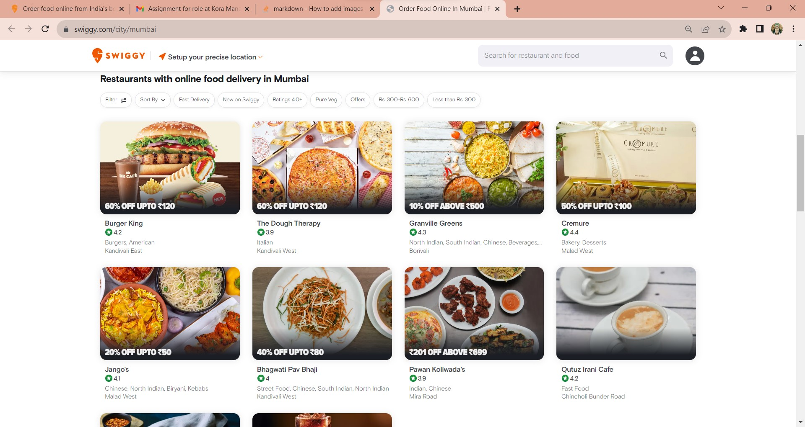
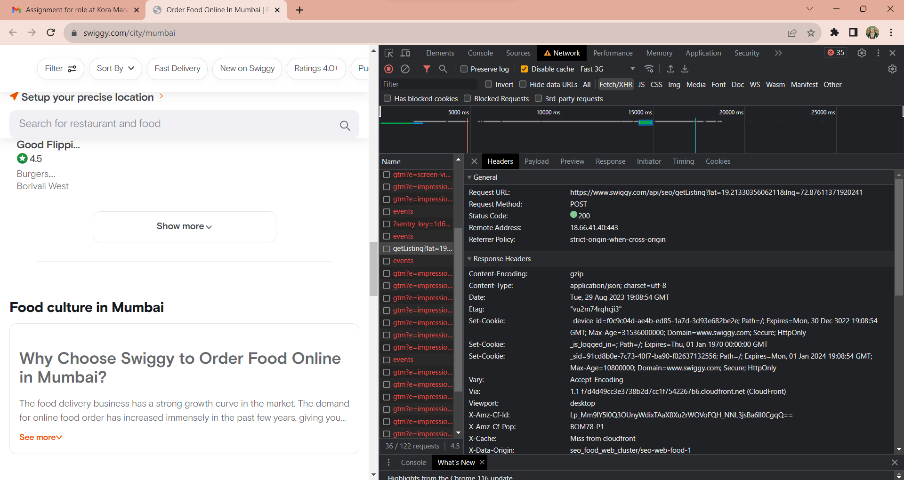
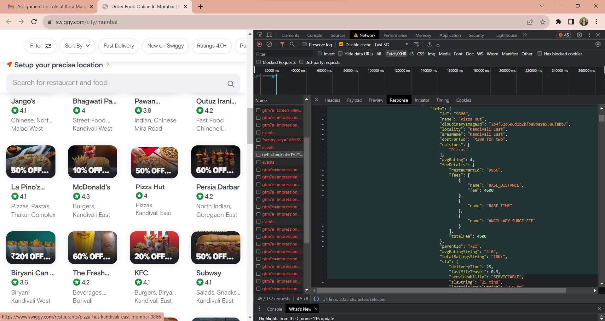

# Swiggy Restaurants Scraper

### Introduction

This Python-based project aims to fulfill a technical assignment for a role at Kora Management. It uses a Scrapy spider to crawl and collect data from Swiggy's online food delivery service. The project starts by navigating to Swiggy's homepage (`https://www.swiggy.com/`). The spider then employs a multi-layered scraping approach:

1. **Extract City Links**: Initially, all available city links are extracted from the Swiggy homepage.

2. **Scrape Restaurants by City**: After obtaining the city links, the spider makes subsequent requests to each city-specific page to collect restaurant data.

3. **Capture Restaurant Details**: Finally, it navigates to each restaurant's individual page to gather additional information such as cost for two, ratings, offers, and more.

The spider stores this data in a structured format, which is then converted into a CSV file for further analysis or storage.

---

### Table of Contents

1. [Introduction](#introduction)
2. [Requirements and Usage](#requirements)
3. [Output](#output)
4. [Code for `swiggy_spider`](#code-for-swiggy_spider)
5. [Challenges Faced and Improved Scraping Approach](#challenges-faced-and-improved-scraping-approach)


---

### Requirements

Please install the necessary packages listed in the `requirements.txt` file using:

```
pip install -r requirements.txt
```

### Usage

1. Open your terminal and navigate to the project directory.
2. Run the following command while in `spiders` directory to start the spider.

```
 scrapy crawl swiggy
``` 

The spider will generate a `restaurant_data.csv` file containing the scraped data, segregated by city.

---

### Output

The output will be a CSV file (`restaurant_data.csv`) containing all the scraped data. It will contain the following columns:

- ID (A unique identifier for each restaurant)
- City Name
- Restaurant URL
- Restaurant Name
- Restaurant Cuisines
- Restaurant Locality
- Restaurant Rating
- Cost for Two
- Count of Ratings
- Offers

---

### Code for swiggy_spider
```
import scrapy
import pandas as pd
import time

class SwiggySpider(scrapy.Spider):
    name = 'swiggy'
    start_urls = ['https://www.swiggy.com/']
    restaurant_data = []
    seen_urls = set()
    custom_settings = {
        'DOWNLOAD_DELAY': 1,
        'RETRY_HTTP_CODES': [403], 
        'RETRY_TIMES': 5, 
    }

    def parse(self, response):
        city_links = response.css('div#city-links a._3TjLz.b-Hy9::attr(href)').getall()

        for city_link in city_links:
            city_url = response.urljoin(city_link)
            city_name = city_link.split('/')[-1]
            yield scrapy.Request(city_url, callback=self.parse_city, meta={'city_name': city_name})

    def parse_city(self, response):
        city_name = response.meta['city_name']
        restaurant_divs = response.css('a.RestaurantList__RestaurantAnchor-sc-1d3nl43-3.kcEtBq')

        for restaurant_div in restaurant_divs:
            restaurant_url = response.urljoin(restaurant_div.css('::attr(href)').get())
            restaurant_name = restaurant_div.css('.sc-beySbM.cwvucc::text').get()
            restaurant_rating = restaurant_div.css('.sw-restaurant-card-subtext-container .sc-beySbM.fTVWWG::text').get()
            restaurant_cuisines = restaurant_div.css('.sw-restaurant-card-descriptions-container .sc-beySbM.iTWFZi:nth-child(1)::text').get()
            restaurant_locality = restaurant_div.css('.sw-restaurant-card-descriptions-container .sc-beySbM.iTWFZi:nth-child(2)::text').get()

            if restaurant_url not in self.seen_urls:
                self.seen_urls.add(restaurant_url)
                initial_data = {
                    'city_name': city_name,
                    'restaurant_url': restaurant_url,
                    'restaurant_name': restaurant_name,
                    'restaurant_cuisines': restaurant_cuisines,
                    'restaurant_locality': restaurant_locality,
                    'restaurant_rating': restaurant_rating,
                }

                yield scrapy.Request(restaurant_url, callback=self.parse_restaurant, meta={'initial_data': initial_data}, errback=self.errback_httpbin)

    def parse_restaurant(self, response): 
        if response.status == 200:
            initial_data = response.meta['initial_data']
            cost_for_two = response.css('li.RestaurantTimeCost_item__2HCUz span::text').get()
            count_of_ratings = response.css('button.RestaurantRatings_wrapper__2294i span.RestaurantRatings_totalRatings__3d6Zc::text').get()
            offers = response.css('.RestaurantOffer_header__3FBtQ::text').getall()
            offers = '; '.join(offers)

            initial_data.update({
                'cost_for_two': cost_for_two,
                'count_of_ratings': count_of_ratings,
                'id': len(self.restaurant_data) + 1,
                'offers': offers
            })

            self.restaurant_data.append(initial_data)
        elif response.status == 403:
            self.log("Received 403 status code. Pausing...")
            time.sleep(60)  
            yield scrapy.Request(response.url, callback=self.parse_restaurant, meta=response.meta, dont_filter=True)
        else:
            self.log(f"Received non-200 status code: {response.status}")

    def errback_httpbin(self, failure): # this method will be called whenever there are errors
        self.log(repr(failure))

    def closed(self, reason):
        df = pd.DataFrame(self.restaurant_data)
        df = df.sort_values('id')

        # Reorder the columns to make 'id' the first column
        columns = ['id'] + [col for col in df.columns if col != 'id']
        df = df[columns]

        df.to_csv('restaurant_data.csv', index=False)
```

### Challenges Faced and Improved Scraping Approach:
The scraping approach I've utilized so far works well for extracting data from the front-end of the website. However, I've come to realize that while this scraping method is effective for retrieving some data, if our goal is to collect all available data (for instance, obtaining data for all restaurants in Mumbai), a different approach is necessary. We need to emulate an API call to extract data from its corresponding JSON response. Let me break down the process:

1. **City Selection**: While navigating within a city's section (such as Mumbai on `https://www.swiggy.com/city/mumbai/`), we initially arrive at a page displaying a subset of restaurants available for online delivery in Mumbai. By default, Swiggy only presents ten restaurants on this webpage. The remaining restaurants are loaded in groups of ten when the "Show more" button is clicked.


2. **Expanding the List**: Upon clicking the "Show more" button, an API call is triggered, retrieving additional restaurant listings. Behind the scenes, this triggers a web request using AJAX to fetch supplementary data. Typically, this call returns data in JSON format, JavaScript code on the page then dynamically updates the displayed content without requiring a complete page refresh.


3. **JSON Response**: Inspecting the response from this API call reveals that it contains all the necessary data for our scraping. Ideally, our approach should replicate this action and extract the required data from the returned JSON object. It's likely that this response is a subset of a larger JSON object stored on Swiggy's backend. This response is likely being constrained by some form of offset parameter. Using partial responses like this helps minimize bandwidth usage and enhances user experience by loading only the additional data required.


4. **Challenge and Solution**: While my current code can scrape data, it might struggle to efficiently fetch all the data, as it scrapes by locating specific selectors. After realizing the ideal way to scrape restaurant data involves mimicking this API call, I've attempted (and continue to try) to replicate the request using Insomnia (a REST API Client similar to Postman). However, lacking access to Swiggy's API documentation has posed difficulties in accurately reproducing this request.

---
